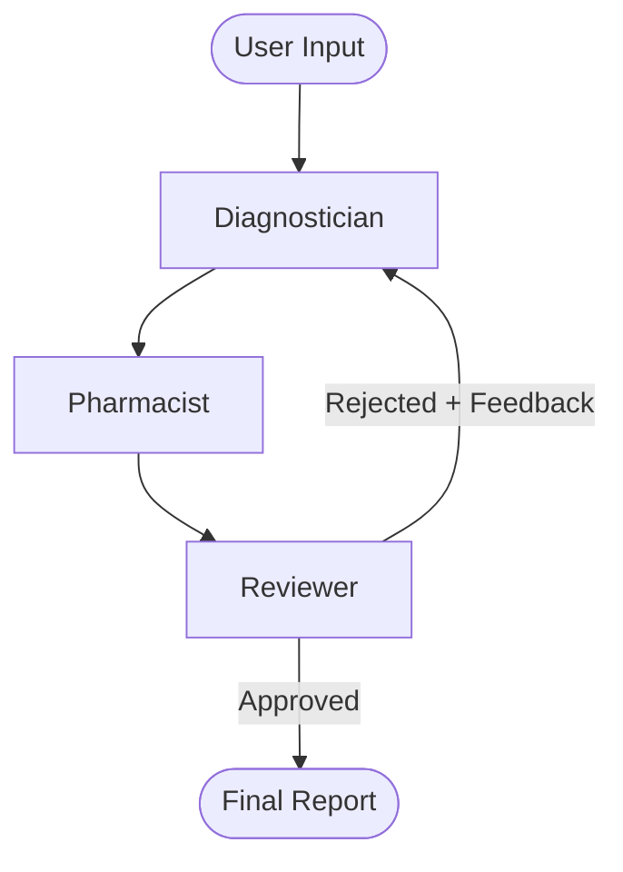
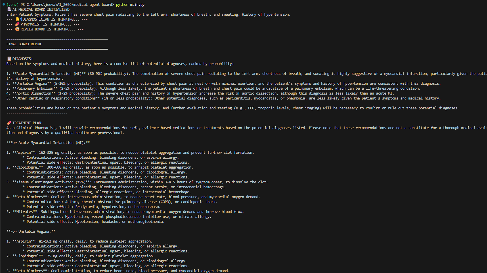

# 🏥 AI Medical Board (Multi-Agent System)

**A Cyclic Multi-Agent System for Clinical Decision Support.**
*Engineered with LangGraph, Llama 3, and State Management.*

## 🚀 Overview
Standard LLMs often hallucinate or miss critical details in complex medical scenarios. This project solves that by orchestrating a **team of specialized AI Agents** that debate, critique, and refine each other's work before producing a final diagnosis.

Unlike linear chatbots, this system uses a **Cyclic Graph Architecture**. If the Reviewer Agent rejects a plan, it loops back to the Diagnostician with specific feedback, forcing an iterative self-correction process.

## 🛠️ Tech Stack
- **Orchestration:** LangGraph (Cyclic State Graphs)
- **LLM:** Llama 3.3 (70B) via Groq
- **Logic:** Conditional Edge Routing & State Persistence
- **Environment:** Python 3.10

## 🧠 The Agentic Workflow
1.  **Diagnostician (Agent A):** Analyzes symptoms and proposes a differential diagnosis.
2.  **Pharmacist (Agent B):** Checks the diagnosis against current medication (e.g., Warfarin) and prescribes treatment.
3.  **Review Board (Agent C):** Evaluates the entire chain for safety and logic.
    * *If Safe:* Outputs "APPROVED".
    * *If Unsafe:* Rejects the plan and loops back to Agent A with critique.

## 📊 Architecture


## 📸 Demo


## 📦 How to Run
Clone the repo.

Install dependencies:

```bash
pip install langgraph langchain langchain-groq python-dotenv colorama
```
Add your `GROQ_API_KEY` to a `.env` file.

Run the simulation:

```bash
python main.py
```

.